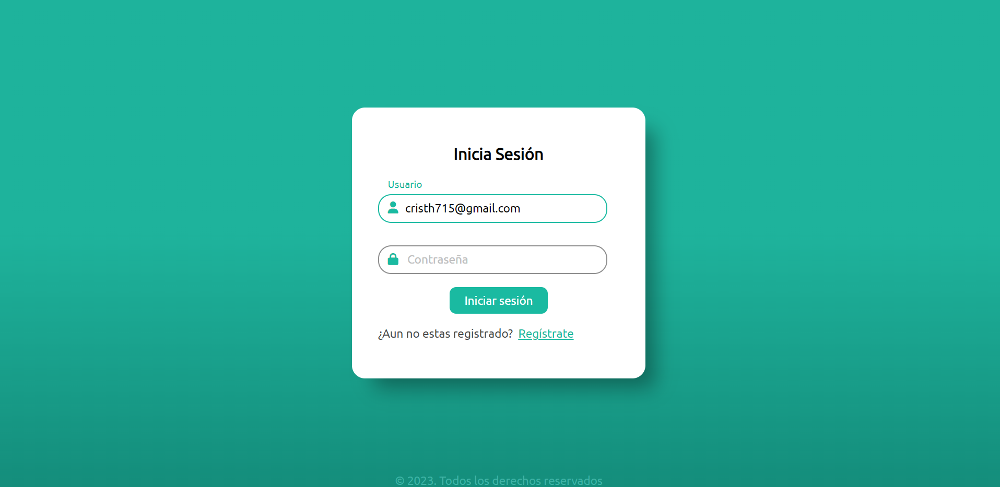
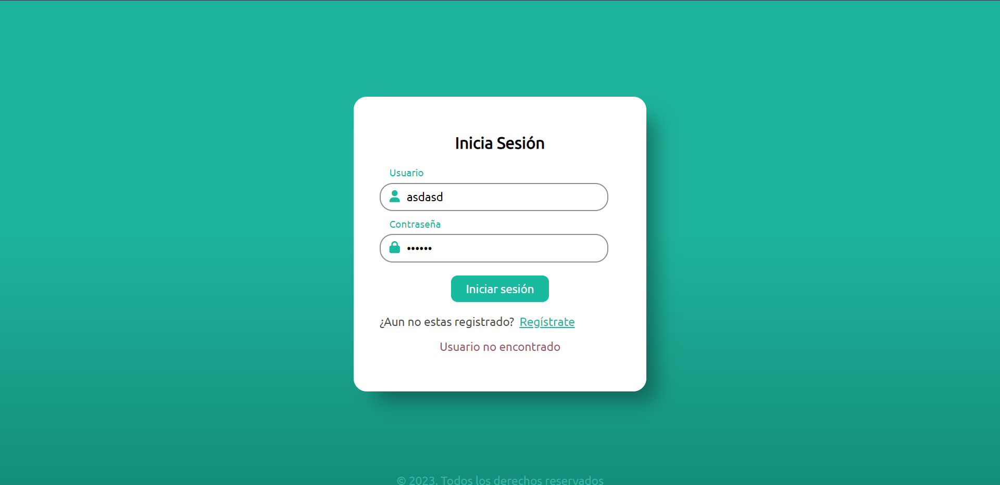
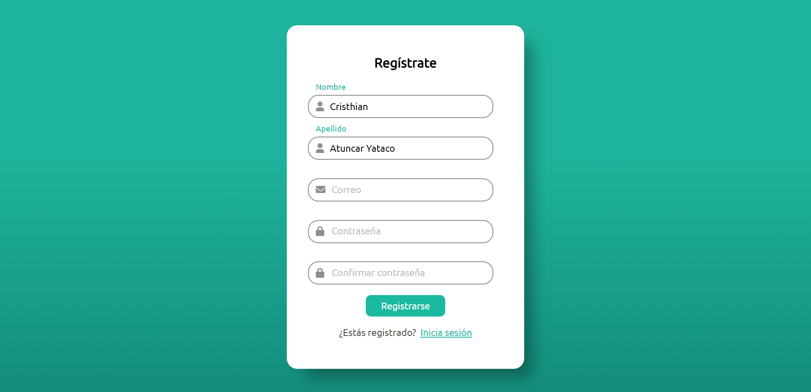

# Simple Login
## Actualización:
  - Implementando php.
## Tecnologías Utilizadas
-  HTML
-  CSS
-  JavaScript
## Objetivos de Aprendizaje
- Practicar la creación de un diseño web básico.
- Comprender cómo se estructura un formulario HTML.
- Aplicar estilos CSS para mejorar la apariencia visual.  
## Capturas de pantalla del login
  - Captura de pantalla 1  
   
  - Captura de pantalla 2  
   
## Capturas de pantalla del registro
  - Captura de pantalla 3  
  
  